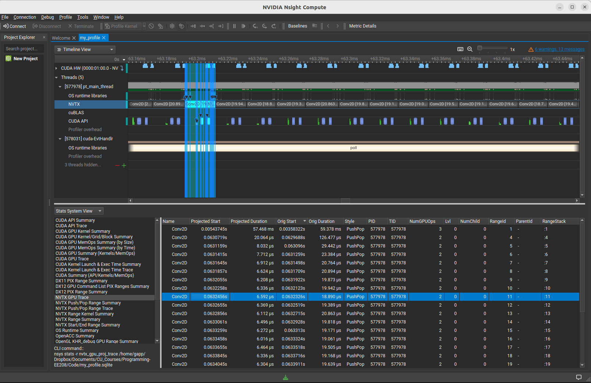

# How to measure the runtime performance


The goal is to provide the code-based example for how to measure the runtime performance.

## Summary

There are many ways to measure the runtime performance: 

1. Time difference is the amount of time spent for the operation (depend on the processor).

2. MACs and flop counts (independent of the processor)
    - Flop counts is the number of operations, which include addition, subtraction, multiplication, and division operations on floating-point numbers.  
    - MACs, on the other hand, is the number of a set of operations, that is, the multiply-accumulate operations that involves one multiplying two numbers and adding the result. Often, used in deep learning apps. 

3. FLOP/s or floating-point operations per second is the number of operations executed per second by a processor.   

  
## Python libraries 

We provide a tutorial about measuring Time difference, MACs, and FLOP/s.

`Profiling_with_libraries.ipynb` 

<a target="_blank" href="https://colab.research.google.com/github/GenAI-CUEE/EE208-Introduction-to-programming-for-EE/blob/master/L4_Runtime_measurement/Profiling_w_libraries.ipynb">
  
</a>


The file contains the examples of how to measure the runtime performance in the following aspects:

1. Time difference
    - [Time library [1]](https://docs.python.org/3/library/time.html)
    - [cProfile library [2]](https://docs.python.org/3/library/profile.html)
2. Macs and flop-counts 
    - [Operation counter (thop) [3]](https://github.com/Lyken17/pytorch-OpCounter)
    - [Torch profiler [4]](https://pytorch.org/tutorials/recipes/recipes/profiler_recipe.html)
3. FLOP/S 
    - [FLOPS profiler [5]](https://pypi.org/project/flops-profiler)

## Nsys profiling

[Nsys profiling [6]](https://dev-discuss.pytorch.org/t/using-nsight-systems-to-profile-gpu-workload/59) is a very useful tool to evaluate the runtime performance.

 You can see our example: `Profiling_with_nvidia.py`. Here, you can track the runtime in each step of your code by using the command `torch.cuda.nvtx.range_push()` and `torch.cuda.nvtx.range_pop()`. You can put a marker of that step by putting a text in `range_push()`, e.g., `torch.cuda.nvtx.range_push('start')`.

Then, all you have to do is running the following command in the command prompt:

```
nsys profile -w true -t cuda,nvtx,osrt,cudnn,cublas -s cpu  --capture-range=cudaProfilerApi --cudabacktrace=true -x true -o my_profile python Profiling_with_nvidia.py --force-overwrite true --cuda-memory-usage true
```

Once you execute the above command, you will get a file called `my_profile.nsys-rep`. Then, you can view the profiled data with NVIDIA Nsignt, which might look like this:

  


### References

1. https://docs.python.org/3/library/time.html
2. https://docs.python.org/3/library/profile.html  
3. https://github.com/Lyken17/pytorch-OpCounter
4. https://pytorch.org/tutorials/recipes/recipes/profiler_recipe.html
5. https://pypi.org/project/flops-profiler 
6. https://dev-discuss.pytorch.org/t/using-nsight-systems-to-profile-gpu-workload/59
 