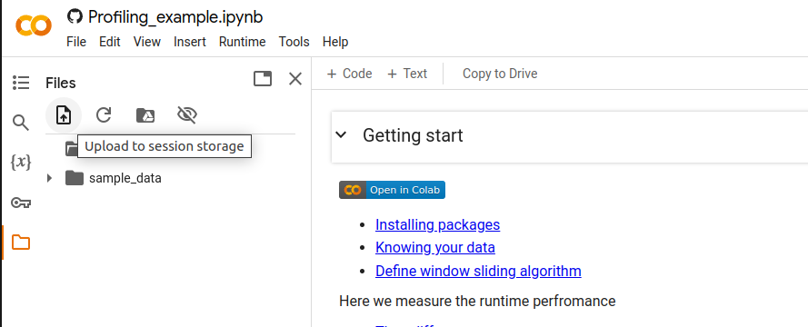

# Profiling Example — Timing a Naive 2D Convolution

A short notebook that introduces **runtime profiling** in Python by implementing a naive (non-vectorized) 2D convolution / window-sliding operation on an image and measuring how its execution time scales with image size.

[](https://colab.research.google.com/github/GenAI-CUEE/EE-208-Coding-Exercise/blob/master/Profiling_example.ipynb)

---

## What's in this notebook

1. **Installing packages** — `matplotlib`, `numpy`, `Pillow`.
2. **Reading input image** — loads a kitten image, resizes it, and extracts a single (red) channel as a 2D NumPy array.
3. **Define the kernel and window-sliding operation** — a hand-written, pure-Python/NumPy triple-nested-loop convolution (`window_sliding`) that slides a 3×3 averaging kernel across the image.
4. **Measure the time difference** — uses `time.perf_counter()` to time a single run of `window_sliding`, then repeats the timing across several image sizes (32×32, 64×64, 128×128, 256×256) to show how runtime grows as the image gets larger.

---

## Learning Goals

- Use `time.perf_counter()` (rather than `time.time()`) for accurate wall-clock timing of a code block.
- Observe empirically how the runtime of a naive nested-loop algorithm scales with input size.
- Build intuition for *why* profiling matters before reaching for optimized/vectorized implementations.

---

## Requirements

- Python 3 (tested on Python 3.12)
- `numpy`
- `matplotlib`
- `Pillow` (PIL)

Install with:

```bash
pip install -U matplotlib numpy Pillow
```

> The notebook's first cell runs `! pip install PIL, numpy` — note this is a slightly malformed pip invocation (comma-separated package list isn't valid syntax for `pip install`); installing `numpy`, `matplotlib`, and `Pillow` as separate arguments (as shown above) is the reliable way to set up the environment.

---

## Required Input File

This notebook expects an image file named **`kitten_00000027.png`** to be present in the same directory it's run from. The notebook references a kitten image dataset from [JoshVarty/ImageClassification](https://github.com/JoshVarty/ImageClassification/tree/master) — you'll need to download a copy of this image (or substitute your own PNG) before running the image-loading cell.


 

1. Download the `kitten_00000027.png` to your local computer ... 

2. Open the ipython notebook from 
<a target="_blank" href="https://colab.research.google.com/github/GenAI-CUEE/EE-208-Coding-Exercise/blob/master/Profiling_example.ipynb">
  
</a>

3. Then add the downloaded picture into the working drive




---

## Running

Open in Jupyter, JupyterLab, or the Colab badge above, and run all cells top to bottom:

```bash
jupyter notebook Profiling_example.ipynb
```

### Expected output (example run)

```
Job took: 379.701 ms
```

followed by, across the four test image sizes:

```
Job took: 6.691 ms
Job took: 8.256 ms
Job took: 30.448 ms
Job took: 118.950 ms
```

Exact numbers will vary by machine, but the **trend** — runtime increasing sharply as image size grows — should hold. This reflects the $O(n^2 \cdot k^2)$ cost of the naive sliding-window approach, where $n$ is the image side length and $k$ is the kernel size.

---

## Notes

- `window_sliding()` is intentionally written as a naive triple-nested loop (over output rows, output columns, and an implicit sum over the kernel window) rather than using a vectorized or FFT-based convolution — this is the point of the exercise, not an oversight. It exists to give a slow baseline worth profiling.
- The notebook does not yet compare this naive implementation against a vectorized alternative (e.g., `scipy.signal.convolve2d` or `numpy` stride tricks) — that would be a natural follow-up exercise.
