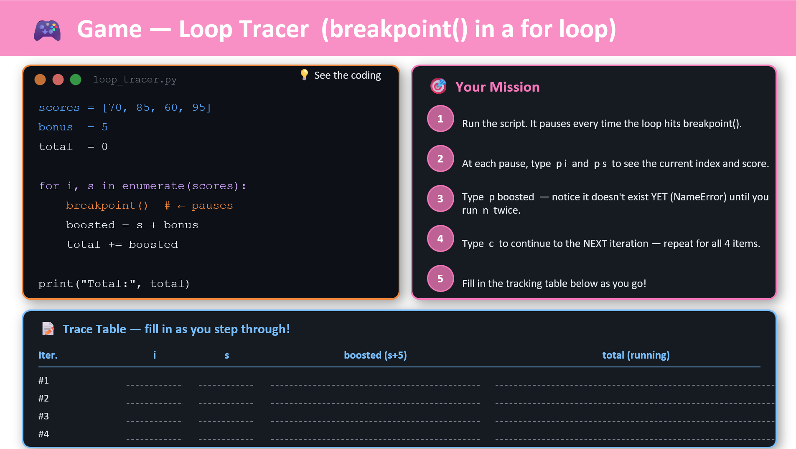
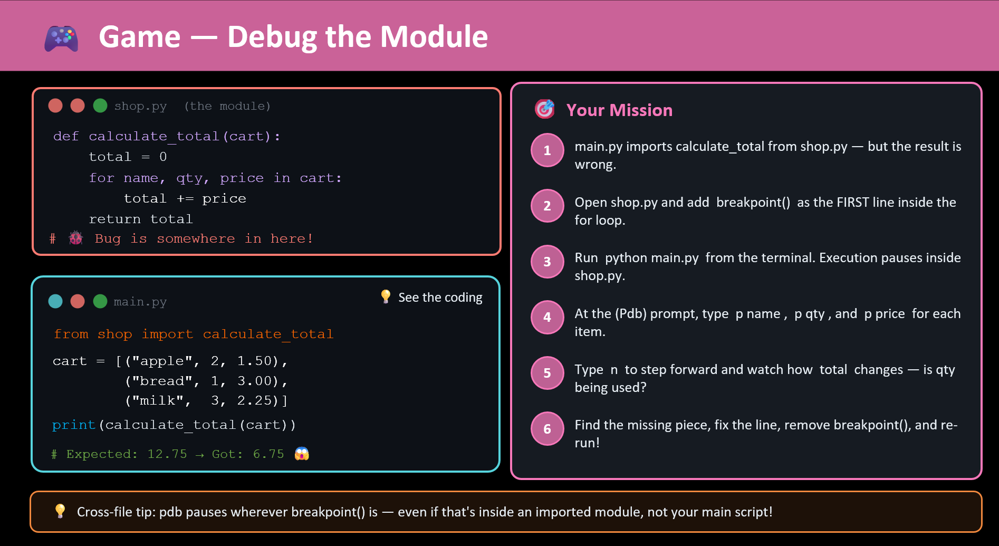
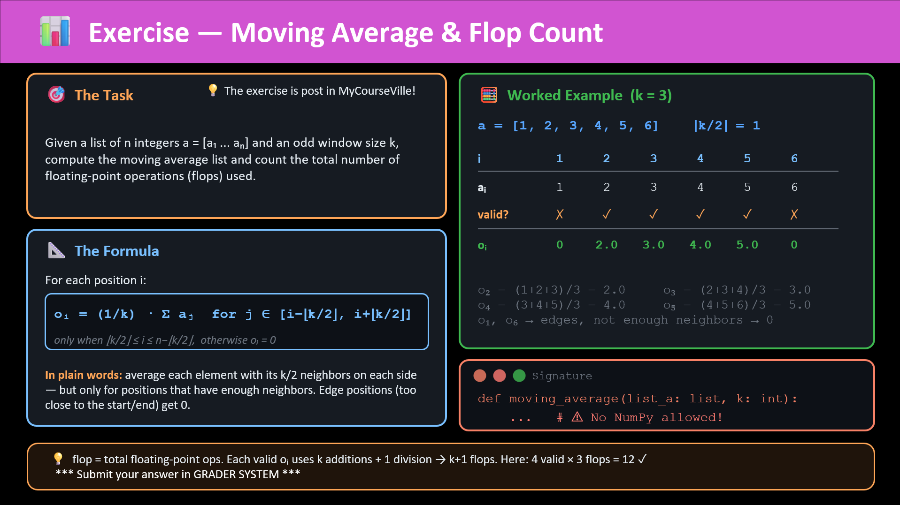
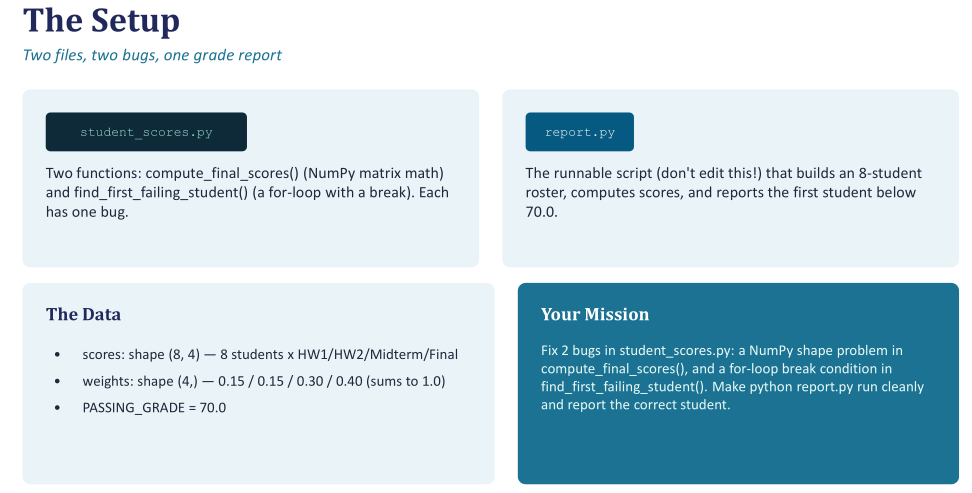

 Our goal is to provide the code-based visualization to understand the idea behind some parts of the lectures in **Programming for EE 2102208** by *Suwichaya Suwanwimolkul*.

### Topics

- [x][Loop Tracer](Loop_Tracer/Readme.md)
    

      
    

- [x][Debug the Module](Debug_the_Module/Readme.md)
    

    
    

- [x][Moving average](Moving_Average/Readme.md)
    

      
    

- [x][Python Runtime Profiling](Profiling_example/Readme.md)

    How to perform runtime profiling. We provide collab example of profiling a 2D filtering example:   
    

    

      
    

- [x][Student score numpy](Student_scores_numpy/Readme.md)

    There are **2 bugs** in `student_scores.py`:

    - **Bug 1** — a NumPy array **shape** problem.
    - **Bug 2** — a `for`-loop `break` condition that's wrong.

    Your job: find and fix both bugs so `python report.py` runs cleanly
    and produces the correct report (see "Expected Output" below).

    

      
    

